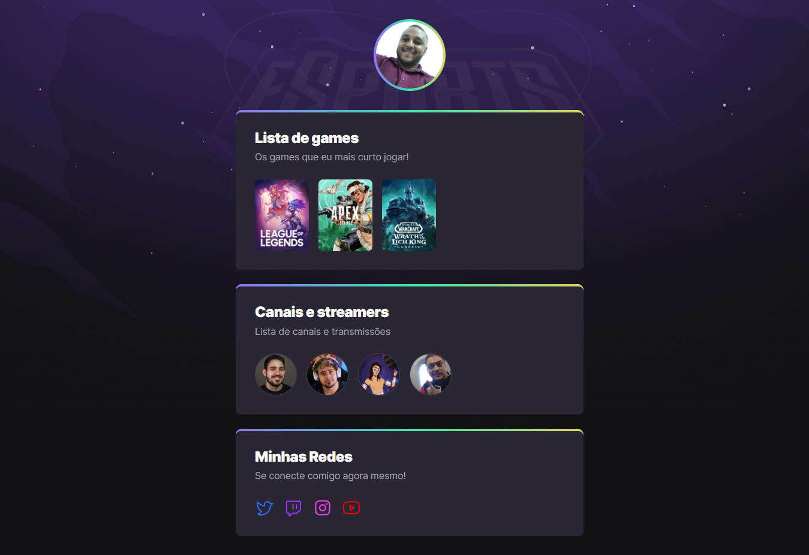

# NLW eSports 

> Trilha Explorer

Projeto construído no evento Next Level Week da 🚀Rocketseat🚀

🔗[Clique aqui para acessar](https://p-a-u-l-o.github.io/nlw-esports-explorer)

## 🛠 Tecnologias

- HTML 
- CSS 
- Git e GitHub

## 🙌🏿Agradecimentos🙌🏿
Gostaria de agradecer a toda a equipe Rocketseat que se empenham verdadeiramente para levar conhecimento de forma eficiente e gratuíta e nesta semana NLW não foi diferente, quero agradecer em especial ao instrutor @[MaykBrito](http://github.com/maykbrito) pela qualidade de sua docência, parabéns e que venham as próximas NEXT LEVEL WEEKS para a gente aprender e também compartihar conhecimentos na comunidade dev que mais cresce no Brasil @[Rocketseat](http://www.rocketseat.com.br).

## 💻 Contato
paulo.ads.silva@hotmail.com

